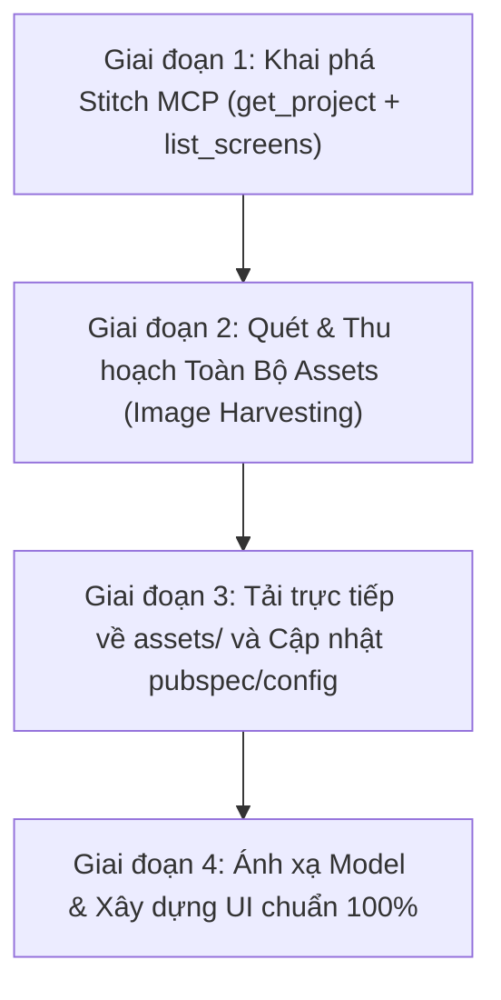

# Stitch-to-Code Full Fidelity Sync (Bóc Tách & Đồng Bộ Toàn Vẹn Stitch)

Skill này đảm bảo khi nhận bất kỳ liên kết Google Stitch nào (`https://stitch.withgoogle.com/projects/<PROJECT_ID>`), Agent sẽ **BẮT BUỘC** thực hiện quy trình trinh sát và tải toàn bộ tài nguyên hình ảnh, nhân vật, icon, layout về dự án trước khi viết một dòng code nào.

---

## 🎯 Triết lý cốt lõi: "Asset-First, Code-Second"
> **Tuyệt đối không dùng Icon/Vector tạm bợ (Placeholder) khi bản thiết kế Stitch đã có ảnh nhân vật, minh họa thực tế hoặc layout chi tiết.**

---

## 🧭 Quy Trình 4 Giai Đoạn Bất Biến (4-Phase Pipeline)

---

### 📍 Giai đoạn 1: Khai phá Siêu Dữ Liệu (Metadata & Design Tokens)
1. Bóc tách `PROJECT_ID` từ URL: `https://stitch.withgoogle.com/projects/15725462203233161747` ➜ `15725462203233161747`.
2. Gọi tool `StitchMCP:get_project` để lấy:
   - `namedColors` & `designMd`: Bảng màu gốc (Primary, Secondary, Surface, Outline, v.v.).
   - `typography`: Font family, font sizes, line heights.
3. Gọi tool `StitchMCP:list_screens` để lấy danh sách toàn bộ các màn hình và asset screens.

---

### 📍 Giai đoạn 2: Quét & Bóc Tách Toàn Bộ Ảnh Nhân Vật (Asset Harvesting)

Stitch chứa 2 nguồn ảnh quan trọng:
1. **Dedicated Illustration Screens**: Các màn hình sinh riêng cho minh họa (có tiêu đề dạng *"A small thumbnail illustration of..."*, *"A clean 2D illustration..."*, *"A large, calming illustration..."*).
   - Lấy trực tiếp `screenshot.downloadUrl`.
2. **Embedded HTML Images**:
   - Đọc nội dung HTML của từng screen (`htmlCode.downloadUrl` qua `read_url_content`).
   - Quét toàn bộ thẻ `` và CSS `background-image`.
   - Lưu lại mô tả `data-alt` để đặt tên file rõ ràng, có ngữ nghĩa (Semantic Naming).

---

### 📍 Giai đoạn 3: Tải Về Cục Bộ (Download to Local Assets)
1. Sử dụng script Python / curl tải toàn bộ ảnh từ Google CDN về thư mục `assets/images/` của dự án (hỗ trợ offline 100%).
2. Đặt tên file chuẩn hóa:
   - `avatar_<role>.png`
   - `hero_<scene>.png`
   - `movement_<action>.png`
   - `workout_<category>.png`
3. Đăng ký thư mục trong `pubspec.yaml` (với Flutter) hoặc cấu hình public assets (với React/Vite/Next.js).

---

### 📍 Giai đoạn 4: Mapping vào Model & Render UI Tràn Viền (Full-Fidelity UI)
1. **Data Model**: Bổ sung trường `illustrationPath` và các hàm getter thông minh `getIllustration()` với fallback an toàn.
2. **UI Cards & Heros**:
   - Thay thế toàn bộ icon nhỏ `56x56` bằng **Cover Image Card (cao 180-200dp)** có bo góc, gradient overlay và status badges.
   - Thêm `errorBuilder` để fallback mượt mà nếu ảnh lỗi.
3. **Verification**:
   - Chạy `flutter analyze` / `npm run build` đạt 0 lỗi.
   - Chạy automated test suite để đảm bảo không gãy logic.

---

## 📋 Bảng Kiểm Tra Chống Bỏ Sót (Zero-Omission Checklist)

Trước khi báo cáo hoàn thành cho Đại Ka, Agent phải tự tích vào bảng sau:

- [ ] Đã quét đủ danh sách tất cả các screens trong `StitchMCP:list_screens`.
- [ ] Đã tải đủ các ảnh Illustration Screens độc lập.
- [ ] Đã quét các thẻ `` và background trong HTML của từng screen.
- [ ] Đã lưu tất cả ảnh về máy (`assets/images/`) và kiểm tra dung lượng > 0 bytes.
- [ ] Đã thay thế toàn bộ widget placeholder/icon tạm bằng `Image.asset` tương ứng.
- [ ] Đã chạy test và static analysis pass 100%.
